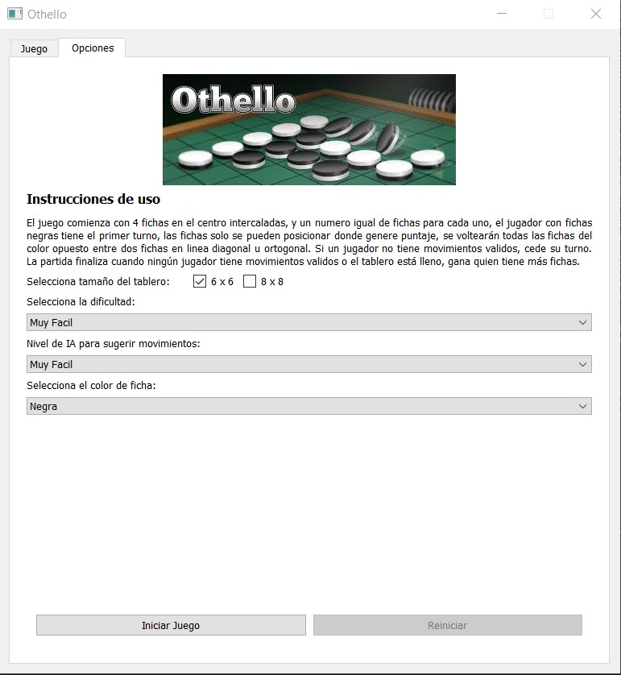
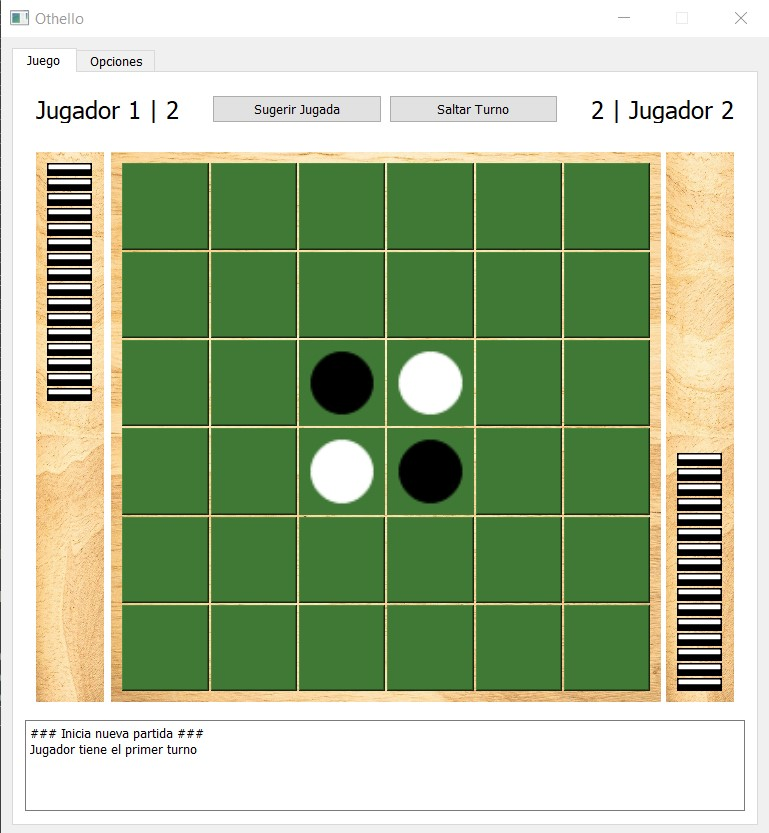
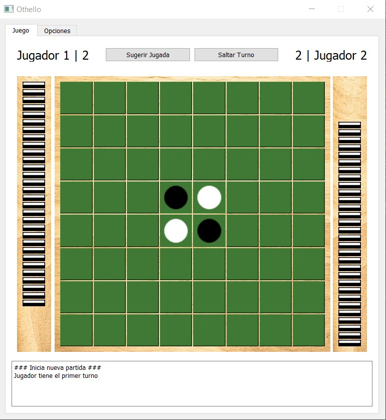
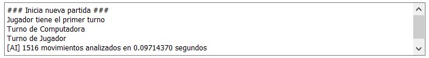
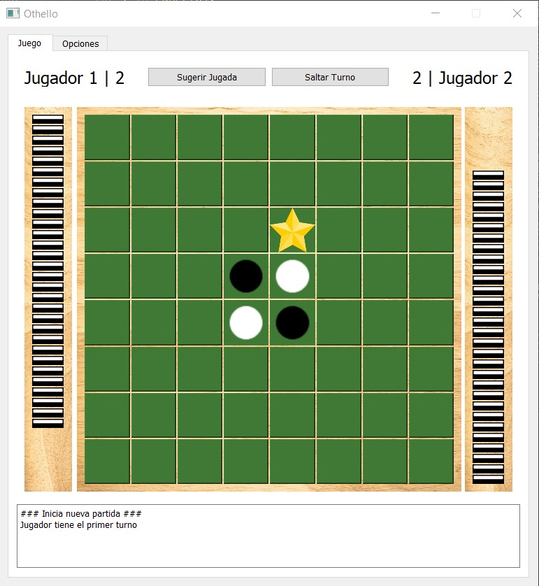

# T01 - Búsqueda Adversarial en Juegos

## Instrucciones de instalación 

Para instalar esta versión de othello, se debe tener versión 3.5 o superior de python, luego se debe generar un entorno de desarrollo con la siguiente sentencia,

```
python -m venv venv
```

Luego de generar el ambiente de desarrollo, se debe activar el ambiente con la sentencia

```
# In cmd.exe
venv\Scripts\activate.bat
# In PowerShell
venv\Scripts\Activate.ps1
# In Linux
$ source myvenv/bin/activate
```

Con esto la indicación (venv) debería aparecer en la consola, se deben instalar las dependencias/librerías utilizadas para el proyecto con el siguiente comando,

```
pip install -r requirements.txt
```

Una vez finalice esta instalación se puede lanzar el programa con

```
python main.py
```

Al lanzarlo se verá la siguiente ventana,



## Funcionalidades

El juego cuenta con algunas opciones, 

Permite tablero de 6x6 y 8x8, tiene contadores para cada jugador, muestra las fichas restantes para cada uno,

<p float="left">
  
  
</p>

El flujo de juego, alertas y termino del juego se muestra en la caja de texto inferior, en esta también se muestra la cantidad de jugadas analizadas y el tiempo tomado por la computadora, esta utiliza el algoritmo de poda alfa beta para obtener la mejor jugada con profundidad definida por el jugador segun el nivel de dificultad.



La función especial que se trabajó en esta tarea fue la de "Sugerir Jugada" que permite además seleccionar en el menú el nivel de ayuda.




## Pasos futuros

Se plantea como trabajo futuro dejar un archivo ejecutable unico en releases para ser descargado sin necesidad de instalación y posibles optimizaciones del agente AI para tener una computadora que pueda predecir mayor cantidad de jugadas en el futuro en el mismo o menor tiempo.